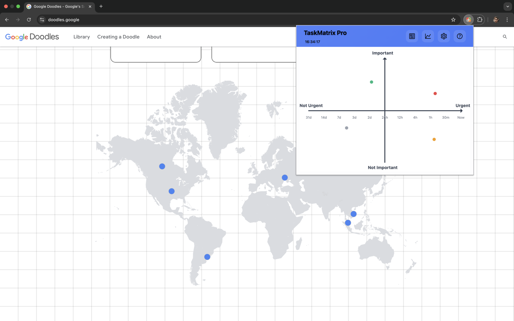
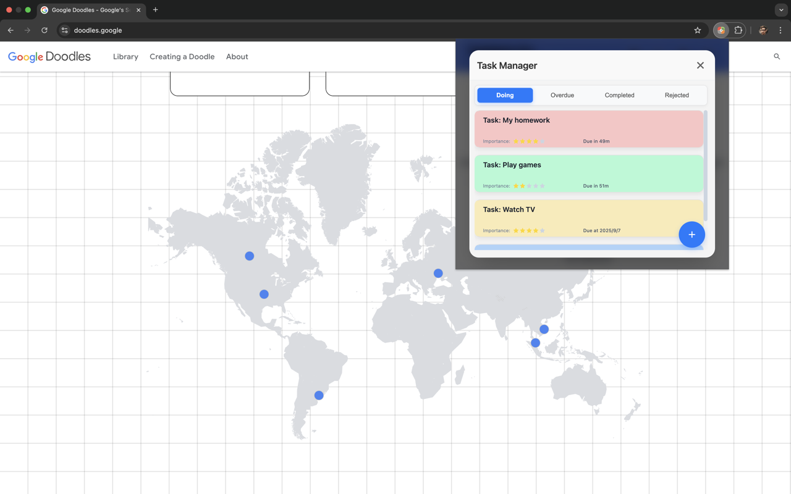
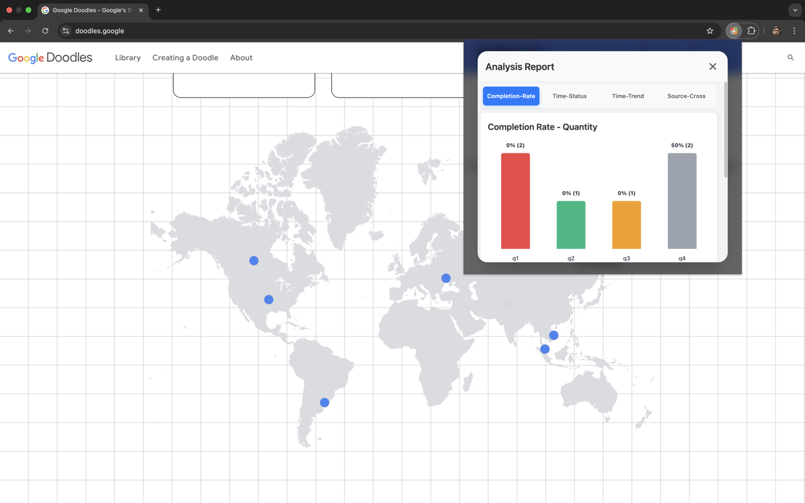
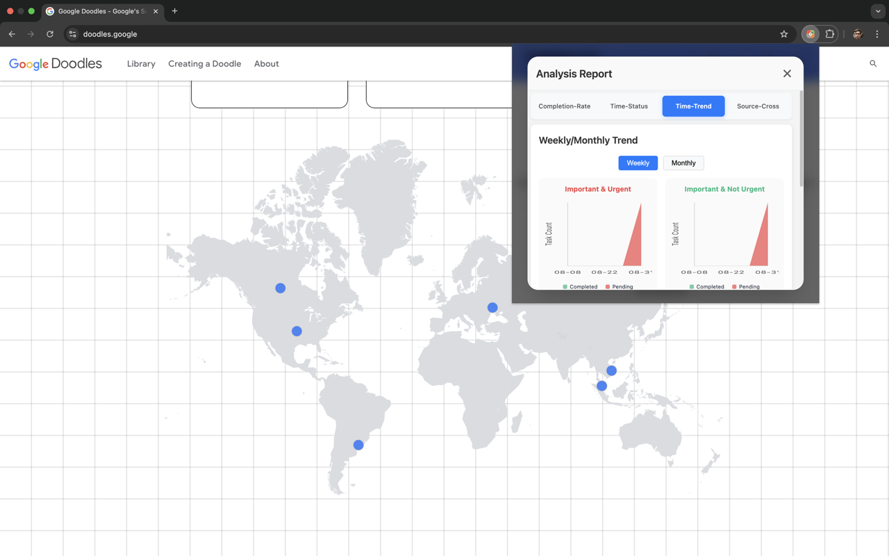

# TaskMatrix Pro

<div align="center">

[](https://chrome.google.com/webstore/detail/qr-code-generator-scanner/fejgdbdgmplakfakmkgbbcefmchldhdf) [](https://addons.mozilla.org/zh-CN/firefox/addon/taskmatrix-pro/)
[](https://chrome.google.com/webstore/detail/qr-code-generator-scanner/fejgdbdgmplakfakmkgbbcefmchldhdf)
[](LICENSE)


**基于艾森豪威尔矩阵的智能任务管理Chrome插件，帮助您通过可视化方式管理任务优先级，提高工作效率。**

</div>

## 🚀 功能特性

### 核心功能
- **任务管理**: 添加、编辑、删除任务，支持重要性等级（0-5级）和完成时间设置
- **艾森豪威尔矩阵**: 实时可视化任务分布，自动根据重要性和紧急程度分类
- **智能提醒**: 基于完成时间的实时紧急程度计算
- **数据分析**: 任务完成情况统计和效率分析
- **数据管理**: 支持数据导出/导入，本地存储保护隐私

### 界面特色
- **现代化设计**: 简洁直观的用户界面
- **响应式布局**: 适配不同屏幕尺寸
- **实时更新**: 矩阵每5分钟自动刷新
- **拖拽交互**: 支持任务拖拽调整位置
- **快捷键支持**: 提高操作效率

## 📸 功能展示

<div align="center">

### 🏠 主页 - 艾森豪威尔矩阵


*直观的四象限任务分布，帮助您清晰掌握任务优先级*

### 📋 任务管理


*完整的任务管理界面，支持添加、编辑、删除任务*

### 📊 可视化报告 - 完成率统计


*详细的任务完成率分析，追踪您的工作效率*

### 📈 可视化报告 - 时间趋势


*时间趋势分析，了解您的工作模式和效率变化*

</div>

> 💡 **推荐**: 从 [Chrome Web Store](https://chrome.google.com/webstore/detail/qr-code-generator-scanner/fejgdbdgmplakfakmkgbbcefmchldhdf) 或 [Firefox Add-ons](https://addons.mozilla.org/zh-CN/firefox/addon/taskmatrix-pro/) 下载体验完整功能！


## 📦 安装说明

### 开发环境安装

1. **克隆项目**
   ```bash
   git clone https://github.com/your-username/taskmatrix-pro.git
   cd taskmatrix-pro
   ```

2. **安装依赖**
   ```bash
   npm install
   ```

3. **构建项目**
   ```bash
   # 开发模式（监听文件变化）
   npm run dev
   
   # 生产模式
   npm run build
   ```

4. **在Chrome中加载插件**
   - 打开Chrome浏览器
   - 访问 `chrome://extensions/`
   - 开启"开发者模式"
   - 点击"加载已解压的扩展程序"
   - 选择项目的 `dist` 目录

### 生产环境安装

1. **从Chrome Web Store安装**（待发布）
   - 访问Chrome Web Store
   - 搜索"TaskMatrix Pro"
   - 点击"添加至Chrome"

2. **手动安装**
   - 下载最新版本的 `.crx` 文件
   - 拖拽到Chrome扩展页面进行安装

## 🎯 使用指南

### 基本操作

1. **添加任务**
   - 点击插件图标打开主界面
   - 点击"添加任务"按钮
   - 填写任务标题、描述、重要性等级和完成时间
   - 选择任务分类和颜色
   - 点击"保存任务"

2. **查看矩阵**
   - 主界面自动显示艾森豪威尔矩阵
   - 任务根据重要性和紧急程度自动分配到四个象限
   - 不同颜色表示不同重要性等级

3. **管理任务**
   - 在左侧任务列表中查看所有任务
   - 使用筛选器查看不同状态的任务
   - 点击任务可编辑或标记完成

### 艾森豪威尔矩阵说明

- **第一象限（重要且紧急）**: 立即处理，避免危机
- **第二象限（重要不紧急）**: 计划安排，预防为主
- **第三象限（紧急不重要）**: 委托他人，减少干扰
- **第四象限（不重要不紧急）**: 避免或删除

### 快捷键

- `Ctrl+N`: 新建任务
- `Ctrl+F`: 搜索任务
- `Ctrl+S`: 保存任务
- `Esc`: 关闭弹窗

## 🛠️ 开发指南

### 项目结构

```
chrome-extension-ato/
├── manifest.json              # 插件清单文件
├── src/                       # 源代码
│   ├── background/            # 后台脚本
│   ├── popup/                 # 弹窗页面
│   ├── options/               # 设置页面
│   ├── content/               # 内容脚本
│   ├── models/                # 数据模型
│   ├── services/              # 业务服务
│   ├── renderers/             # 渲染器
│   ├── utils/                 # 工具函数
│   └── components/            # UI组件
├── assets/                    # 静态资源
│   ├── icons/                 # 图标文件
│   └── images/                # 图片资源
├── dist/                      # 构建输出
└── tests/                     # 测试文件
```

### 技术栈

- **前端**: HTML5, CSS3, JavaScript ES6+
- **构建工具**: Webpack 5
- **代码规范**: ESLint, Prettier
- **测试框架**: Jest
- **数据可视化**: Canvas API
- **存储**: Chrome Storage API

### 开发命令

```bash
# 开发模式
npm run dev

# 构建生产版本
npm run build

# 运行测试
npm test

# 代码检查
npm run lint

# 代码格式化
npm run format

# 清理构建文件
npm run clean

# 打包插件
npm run package
```

### 核心模块

#### 数据模型
- `Task`: 任务数据模型
- `Matrix`: 艾森豪威尔矩阵模型

#### 服务层
- `StorageManager`: 存储管理服务
- `TaskManager`: 任务管理服务
- `MatrixManager`: 矩阵管理服务

#### 渲染器
- `MatrixRenderer`: 矩阵可视化渲染器

### 扩展开发

#### 添加新功能
1. 在 `src/` 目录下创建相应的模块
2. 更新 `manifest.json` 配置
3. 添加相应的测试用例
4. 更新文档

#### 自定义样式
- 修改 `src/popup/popup.css` 文件
- 支持主题切换功能
- 遵循设计规范

## 📊 数据分析

### 统计指标
- 总任务数
- 已完成任务数
- 完成率
- 按时完成率
- 超期任务数
- 各象限任务分布

### 数据导出
- 支持JSON格式导出
- 包含任务数据和设置
- 支持数据版本控制

## 🔧 配置选项

### 插件设置
- **主题**: 浅色/深色主题
- **语言**: 多语言支持
- **通知**: 开启/关闭通知
- **自动刷新**: 设置刷新间隔
- **默认重要性**: 设置默认重要性等级

### 数据管理
- **导出数据**: 备份所有数据
- **导入数据**: 恢复数据
- **清空数据**: 删除所有数据
- **存储使用情况**: 查看存储占用

## 🐛 故障排除

### 常见问题

1. **插件无法加载**
   - 检查Chrome版本是否支持（需要88+）
   - 确认开发者模式已开启
   - 重新加载插件

2. **数据丢失**
   - 检查Chrome存储空间
   - 尝试导入备份数据
   - 联系技术支持

3. **矩阵显示异常**
   - 刷新页面
   - 检查任务数据完整性
   - 重新构建项目

### 调试模式

1. **开启调试**
   - 在扩展页面点击"检查视图"
   - 使用Chrome DevTools调试

2. **查看日志**
   - 打开开发者工具
   - 查看Console面板的日志信息

## 🤝 贡献指南

### 参与贡献
1. Fork 项目
2. 创建功能分支
3. 提交更改
4. 发起 Pull Request

### 代码规范
- 遵循ESLint配置
- 使用Prettier格式化
- 编写单元测试
- 更新相关文档

### 提交规范
```
feat: 添加新功能
fix: 修复bug
docs: 更新文档
style: 代码格式化
refactor: 代码重构
test: 添加测试
chore: 构建过程或辅助工具的变动
```

## 📄 许可证

本项目采用 MIT 许可证 - 查看 [LICENSE](LICENSE) 文件了解详情。

## 📞 联系我们

- **项目主页**: [GitHub Repository](https://github.com/Navyum/chrome-extension-task-matrix)
- **问题反馈**: [Issues](https://github.com/Navyum/chrome-extension-task-matrix/issues)
- **功能建议**: [Discussions](https://github.com/Navyum/chrome-extension-task-matrix/discussions)

## 🙏 致谢

感谢所有为这个项目做出贡献的开发者和用户！

---

**TaskMatrix Pro** - 让任务管理更高效，让时间更有价值！